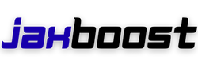

<p align="center">
  
</p>

[](https://github.com/jxu/jaxboost/actions/workflows/tests.yml)
[](https://github.com/jxu/jaxboost/actions/workflows/lint.yml)
[](https://www.python.org/downloads/)
[](https://www.apache.org/licenses/LICENSE-2.0)

**JAX autodiff for XGBoost/LightGBM objectives.**

Write a loss function, get gradients and Hessians automatically. No manual derivation needed.

## Install

```bash
pip install jaxboost
```

## Quick Start

```python
import xgboost as xgb
from jaxboost import auto_objective, focal_loss, huber, quantile

# Built-in objectives - just use them
model = xgb.train(params, dtrain, obj=focal_loss.xgb_objective)
model = xgb.train(params, dtrain, obj=huber.xgb_objective)
model = xgb.train(params, dtrain, obj=quantile(0.9).xgb_objective)

# Custom objective - write the loss, autodiff handles the rest
@auto_objective
def asymmetric_mse(y_pred, y_true, alpha=0.7):
    error = y_true - y_pred
    return jnp.where(error > 0, alpha * error**2, (1 - alpha) * error**2)

model = xgb.train(params, dtrain, obj=asymmetric_mse.xgb_objective)
```

Works with **XGBoost**, **LightGBM**, and **CatBoost**.

## Available Objectives

### Regression
| Objective | Description |
|-----------|-------------|
| `mse` | Mean squared error |
| `huber` | Huber loss (robust to outliers) |
| `quantile(q)` | Quantile regression |
| `tweedie(p)` | Tweedie deviance |
| `asymmetric(alpha)` | Asymmetric squared error |
| `log_cosh` | Log-cosh loss |

### Binary Classification
| Objective | Description |
|-----------|-------------|
| `focal_loss` | Focal loss for imbalanced data |
| `binary_crossentropy` | Standard log loss |
| `hinge_loss` | SVM-style hinge loss |

### Multi-class Classification
| Objective | Description |
|-----------|-------------|
| `softmax_cross_entropy` | Standard multi-class |
| `focal_multiclass` | Focal loss for multi-class |
| `label_smoothing(eps)` | Label smoothing regularization |

### Survival Analysis
| Objective | Description |
|-----------|-------------|
| `aft` | Accelerated failure time (log-normal) |
| `weibull_aft` | Weibull AFT model |

### Multi-task Learning
| Objective | Description |
|-----------|-------------|
| `multi_task_regression` | Multiple regression targets |
| `multi_task_classification` | Multiple classification targets |
| `MaskedMultiTaskObjective` | Handle missing labels |

### Uncertainty Estimation
| Objective | Description |
|-----------|-------------|
| `gaussian_nll` | Predict mean + variance |
| `laplace_nll` | Predict median + scale |

## Custom Objectives

The `@auto_objective` decorator turns any loss function into an XGBoost/LightGBM objective:

```python
import jax.numpy as jnp
from jaxboost import auto_objective

@auto_objective
def my_custom_loss(y_pred, y_true, **kwargs):
    # Write your loss here - JAX computes grad/hess automatically
    return (y_pred - y_true) ** 2

# Use with XGBoost
model = xgb.train(params, dtrain, obj=my_custom_loss.xgb_objective)

# Use with LightGBM
model = lgb.train(params, dtrain, fobj=my_custom_loss.lgb_objective)

# Pass parameters
model = xgb.train(params, dtrain, obj=my_custom_loss.get_xgb_objective(alpha=0.5))
```

## Multi-class Example

```python
from jaxboost import multiclass_objective
import jax.numpy as jnp

@multiclass_objective(num_classes=3)
def custom_multiclass(logits, label):
    # logits: (num_classes,), label: scalar
    probs = jax.nn.softmax(logits)
    return -jnp.log(probs[label] + 1e-7)

model = xgb.train(
    {"num_class": 3, "objective": "multi:softmax"},
    dtrain,
    obj=custom_multiclass.xgb_objective
)
```

## Why jaxboost?

| Traditional Approach | jaxboost |
|---------------------|----------|
| Derive gradients by hand | Write loss, get gradients free |
| Derive Hessians by hand | Write loss, get Hessians free |
| Error-prone math | JAX autodiff is correct by construction |
| One loss = hours of work | One loss = 5 lines of code |

## Requirements

- Python >= 3.10
- JAX >= 0.4.20

## License

Apache 2.0
